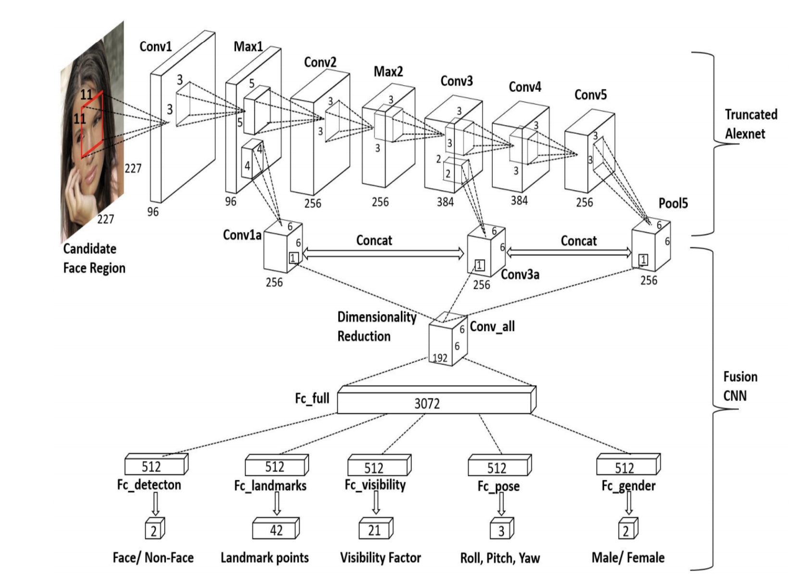

# HyperFace

## Abstract

A multi-task learning convolutional neural network for the purpose of
performing landmark localization and other correlated tasks is studied and
analysed in this project. A different and more challenging task around
landmark localization than the one implemented originally is studied using
a HyperFace architecture. It is seen that having a multi-task CNN helps
improving the accuracy among the correlated tasks. A lot of tasks in
Computer Vision are actually correlated and thus architectures like these
can prove to be very useful. We present extensive results on the training
of multitask network in different scenarios and the complexities in training
them. Though our model is modestly trained on a dataset that is new for
HyperFace, it is found to give reasonably good results.

## Architecture for HyperFace

